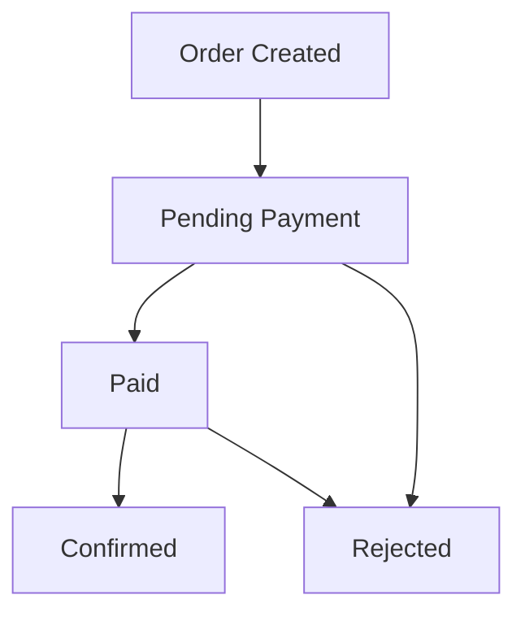

# FarmArt Backend

A robust Flask-based backend API for livestock trading and order management.

## Tech Stack

- **Web Framework**: Flask 3.0.0
- **ORM**: Flask-SQLAlchemy 3.1.1
- **Authentication**: Flask-JWT-Extended 4.6.0
- **Database**: SQLite/PostgreSQL
- **Runtime**: Python 3.8+

## Installation

1. **Clone and setup**
   ```bash
   git clone <repository-url>
   cd farmart-backend
   python -m venv venv
   source venv/bin/activate  # Linux/Mac
   venv\Scripts\activate     # Windows
   ```

2. **Install dependencies**
   ```bash
   pip install -r requirements.txt
   ```

3. **Environment setup**
   Create `.env` file with:
   ```bash
   DATABASE_URL=sqlite:///instance/farmart_dev.db
   MPESA_CONSUMER_KEY=your_key
   MPESA_CONSUMER_SECRET=your_secret
   MPESA_ENV=sandbox
   MPESA_SHORTCODE=174379
   MPESA_PASSKEY=your_passkey
   MPESA_CALLBACK_URL=https://your-domain.com/api/orders/mpesa/callback
   ```

4. **Initialize database**
   ```bash
   python -c "from app import create_app; app = create_app(); from app.models.models import db; db.create_all(app=app)"
   ```

5. **Run application**
   ```bash
   python app.py
   ```

## API Endpoints

### Authentication Required
All endpoints require JWT token:
```
Authorization: Bearer <your-jwt-token>
```

### Order Management
- `GET /api/orders` - Get user's orders
- `GET /api/orders/<id>` - Get specific order
- `POST /api/orders` - Create new order (buyers only)
- `POST /api/orders/<id>/pay` - Initiate M-Pesa payment
- `POST /api/orders/<id>/confirm` - Confirm order (farmers only)
- `POST /api/orders/<id>/reject` - Reject order (farmers only)

### M-Pesa Callback
- `POST /api/orders/mpesa/callback` - Handle payment callbacks

### Example API Usage

**Create an Order**
```bash
curl -X POST http://localhost:5000/api/orders \
  -H "Authorization: Bearer your-jwt-token" \
  -H "Content-Type: application/json" \
  -d '{
    "items": [
      {
        "animal_id": 1,
        "quantity": 2
      }
    ]
  }'
```

**Response**
```json
{
  "id": 1,
  "buyer_id": 1,
  "status": "pending",
  "created_at": "2023-10-01T10:30:00",
  "items": [
    {
      "id": 1,
      "animal_id": 1,
      "farmer_id": 2,
      "quantity": 2
    }
  ]
}
```

##  Database Schema
## Database Schema

### Core Models
- **User**: Buyers and farmers with role-based access
- **Animal**: Livestock catalog with pricing and availability
- **Order**: Purchase orders with M-Pesa integration
- **OrderItem**: Items within orders

## Configuration

### Environment Variables
- `FLASK_ENV`: Application environment
- `DATABASE_URL`: Database connection string
- `JWT_SECRET_KEY`: JWT signing key
- `MPESA_*`: M-Pesa Daraja API configuration

## Order Lifecycle

1. **Order Created** → **Pending Payment** → **Paid** → **Confirmed**
2. **Order Created** → **Pending Payment** → **Rejected**

## License

## 🚨 Error Handling

The API provides consistent error responses:

```json
{
  "error": "Descriptive error message"
}
```

### HTTP Status Codes

| Code | Description |
|------|-------------|
| `200` | Success |
| `201` | Resource created |
| `400` | Bad request (validation errors) |
| `401` | Unauthorized |
| `403` | Forbidden (authorization failure) |
| `404` | Resource not found |
| `500` | Internal server error |

## 🏗️ Development

### Code Style
- Follow [PEP 8](https://www.python.org/dev/peps/pep-0008/) guidelines
- Use meaningful variable and function names
- Add comprehensive docstrings to all functions and classes
- Implement proper logging for production monitoring

### Project Structure
```
farmart-backend/
├── app/                          # Main application package
│   ├── __init__.py              # Application factory
│   ├── models/                  # Database models
│   │   ├── __init__.py
│   │   └── models.py            # User, Animal, Order models
│   └── routes/                  # API endpoints
│       ├── __init__.py
│       └── orders.py            # Order management endpoints
├── config.py                    # Configuration classes
├── requirements.txt             # Production dependencies
├── README.md                    # This file
└── TECHNICAL_DOCUMENTATION.md   # Technical documentation
```

### Testing
Tests should be added to the `tests/` directory following pytest conventions.

### Contributing

1. Fork the repository
2. Create a feature branch (`git checkout -b feature/amazing-feature`)
3. Make your changes with proper commit messages
4. Add tests for your changes
5. Run the test suite (`pytest`)
6. Submit a pull request

##  Deployment

### Production Requirements
- Python 3.8+
- PostgreSQL database
- Production WSGI server (Gunicorn, uWSGI)
- Reverse proxy (nginx recommended)
- Environment variables configured

### Deployment Steps
1. Set production environment variables
2. Install production dependencies
3. Run database migrations
4. Configure reverse proxy
5. Set up monitoring and logging
6. Implement backup strategies

## 📋 Order Lifecycle



1. **Order Creation**: Buyer creates order with selected animals
2. **Pending Payment**: Order status set to 'pending'
3. **Payment**: Buyer marks order as 'paid'
4. **Confirmation**: Farmer confirms order fulfillment
5. **Completion**: Order status becomes 'confirmed'

## 📄 License

This project is licensed under the MIT License - see the [LICENSE](LICENSE) file for details.

## 🤝 Contributing

Contributions are welcome! Please read our [Contributing Guidelines](CONTRIBUTING.md) for details on our code of conduct and the process for submitting pull requests.

## 📞 Support

For support, email support@farmart.com or join our Slack channel.


## 🙌 Collaborators

This project was built by:

- Linda Jerop
- Thecla Owano
- Vanessa Omondi
- Jonah Tarus
- Raniel Musyoki

## 📝 Emoji Credits

Emojis used in this README were obtained from [UNICODE emojis](https://unicode.org/emoji/charts/full-emoji-list.html).

## 🙏 Acknowledgments

- Flask community for the excellent web framework
- SQLAlchemy team for powerful ORM capabilities
- All contributors who have helped improve this project

---

**Made with ❤️ for the farming community**
