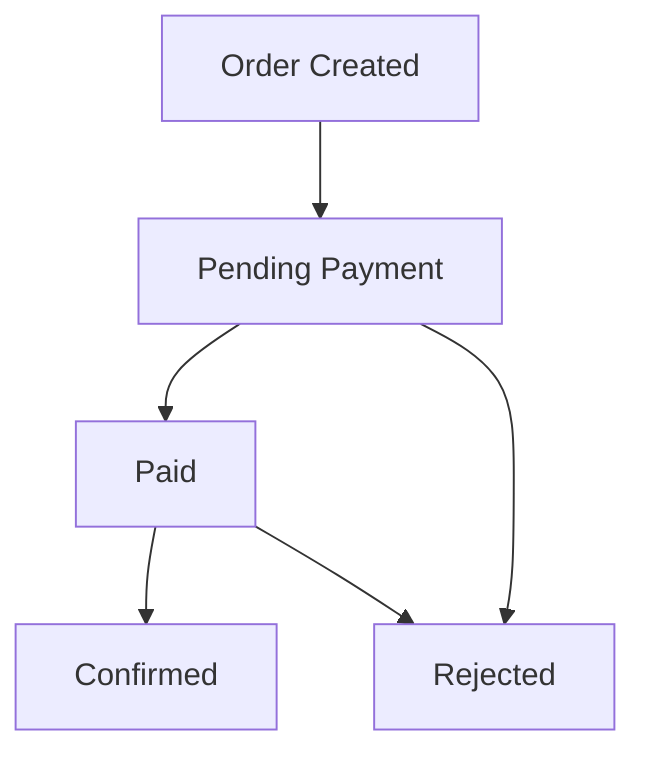

#  FarmArt Backend

[](https://python.org)
[](https://flask.palletsprojects.com/)
[](LICENSE)

> A robust Flask-based backend API for livestock trading and order management

##  Features

- ** Secure Authentication** - JWT-based authentication with role-based access control
- ** User Management** - Separate roles for buyers and farmers with proper authorization
- ** Animal Catalog** - Farmers can list available livestock with pricing and availability
- ** Complete Order Management** - Full order lifecycle from creation to confirmation
- ** Database Ready** - SQLAlchemy ORM with SQLite (development) and PostgreSQL (production) support
- ** RESTful API** - Clean, well-documented REST endpoints with comprehensive error handling
- ** Production Ready** - Environment-based configuration, logging, and error handling

##  Tech Stack

| Component | Technology | Purpose |
|-----------|------------|---------|
| **Web Framework** | Flask 3.0.0 | Lightweight web framework |
| **ORM** | Flask-SQLAlchemy 3.1.1 | Database abstraction layer |
| **Authentication** | Flask-JWT-Extended 4.6.0 | JWT token-based authentication |
| **Database** | SQLite/PostgreSQL | Data persistence |
| **Configuration** | python-dotenv 1.0.0 | Environment variable management |
| **Runtime** | Python 3.8+ | Application runtime |

##  Installation

### Prerequisites
- Python 3.8 or higher
- pip package manager

### Quick Start

1. **Clone the repository**
   ```bash
   git clone <repository-url>
   cd farmart-backend
   ```

2. **Set up virtual environment**
   ```bash
   python -m venv venv
   # On Linux/Mac:
   source venv/bin/activate
   # On Windows:
   venv\Scripts\activate
   ```

3. **Install dependencies**
   ```bash
   pip install -r requirements.txt
   ```

4. **Configure environment** (optional)
   ```bash
   # Development configuration
   export FLASK_ENV=development
   export DATABASE_URL=sqlite:///farmart.db
   export JWT_SECRET_KEY=your-secure-secret-key-here
   ```

5. **Run the application**
   ```bash
   python -m flask run
   ```

   The API will be available at `http://localhost:5000`

##  API Endpoints

### Authentication
All endpoints require a valid JWT token in the Authorization header:
```
Authorization: Bearer <your-jwt-token>
```

### Order Management

| Method | Endpoint | Description | Roles |
|--------|----------|-------------|-------|
| `GET` | `/api/orders` | Get user's orders | Buyers & Farmers |
| `GET` | `/api/orders/<id>` | Get specific order | Buyers & Farmers |
| `POST` | `/api/orders` | Create new order | Buyers only |
| `POST` | `/api/orders/<id>/pay` | Mark order as paid | Buyers only |
| `POST` | `/api/orders/<id>/confirm` | Confirm order | Farmers only |
| `POST` | `/api/orders/<id>/reject` | Reject order | Farmers only |

### Example API Usage

**Create an Order**
```bash
curl -X POST http://localhost:5000/api/orders \
  -H "Authorization: Bearer your-jwt-token" \
  -H "Content-Type: application/json" \
  -d '{
    "items": [
      {
        "animal_id": 1,
        "quantity": 2
      }
    ]
  }'
```

**Response**
```json
{
  "id": 1,
  "buyer_id": 1,
  "status": "pending",
  "created_at": "2023-10-01T10:30:00",
  "items": [
    {
      "id": 1,
      "animal_id": 1,
      "farmer_id": 2,
      "quantity": 2
    }
  ]
}
```

## 🗄️ Database Schema

### Core Models

#### User
```sql
CREATE TABLE user (
    id INTEGER PRIMARY KEY AUTOINCREMENT,
    username VARCHAR(80) UNIQUE NOT NULL,
    role VARCHAR(20) NOT NULL CHECK(role IN ('buyer', 'farmer'))
);
```

#### Animal
```sql
CREATE TABLE animal (
    id INTEGER PRIMARY KEY AUTOINCREMENT,
    name VARCHAR(100) NOT NULL,
    farmer_id INTEGER NOT NULL,
    available BOOLEAN DEFAULT 1,
    price FLOAT NOT NULL,
    created_at DATETIME DEFAULT CURRENT_TIMESTAMP,
    FOREIGN KEY (farmer_id) REFERENCES user (id)
);
```

#### Order
```sql
CREATE TABLE order (
    id INTEGER PRIMARY KEY AUTOINCREMENT,
    buyer_id INTEGER NOT NULL,
    status VARCHAR(20) DEFAULT 'pending',
    created_at DATETIME DEFAULT CURRENT_TIMESTAMP,
    FOREIGN KEY (buyer_id) REFERENCES user (id)
);
```

#### OrderItem
```sql
CREATE TABLE order_item (
    id INTEGER PRIMARY KEY AUTOINCREMENT,
    order_id INTEGER NOT NULL,
    animal_id INTEGER NOT NULL,
    farmer_id INTEGER NOT NULL,
    quantity INTEGER NOT NULL,
    FOREIGN KEY (order_id) REFERENCES order (id),
    FOREIGN KEY (animal_id) REFERENCES animal (id),
    FOREIGN KEY (farmer_id) REFERENCES user (id)
);
```

## ⚙️ Configuration

### Environment Variables

| Variable | Default | Description |
|----------|---------|-------------|
| `FLASK_ENV` | `development` | Application environment |
| `DATABASE_URL` | `sqlite:///farmart.db` | Database connection string |
| `JWT_SECRET_KEY` | `dev-secret-key-change-in-production` | JWT signing key |

### Configuration Profiles

- **Development**: Debug mode enabled, SQLite database, detailed logging
- **Testing**: In-memory database, test-specific settings
- **Production**: Environment variables required, optimized settings

## 🚨 Error Handling

The API provides consistent error responses:

```json
{
  "error": "Descriptive error message"
}
```

### HTTP Status Codes

| Code | Description |
|------|-------------|
| `200` | Success |
| `201` | Resource created |
| `400` | Bad request (validation errors) |
| `401` | Unauthorized |
| `403` | Forbidden (authorization failure) |
| `404` | Resource not found |
| `500` | Internal server error |

## 🏗️ Development

### Code Style
- Follow [PEP 8](https://www.python.org/dev/peps/pep-0008/) guidelines
- Use meaningful variable and function names
- Add comprehensive docstrings to all functions and classes
- Implement proper logging for production monitoring

### Project Structure
```
farmart-backend/
├── app/                          # Main application package
│   ├── __init__.py              # Application factory
│   ├── models/                  # Database models
│   │   ├── __init__.py
│   │   └── models.py            # User, Animal, Order models
│   └── routes/                  # API endpoints
│       ├── __init__.py
│       └── orders.py            # Order management endpoints
├── config.py                    # Configuration classes
├── requirements.txt             # Production dependencies
├── README.md                    # This file
└── TECHNICAL_DOCUMENTATION.md   # Technical documentation
```

### Testing
Tests should be added to the `tests/` directory following pytest conventions.

### Contributing

1. Fork the repository
2. Create a feature branch (`git checkout -b feature/amazing-feature`)
3. Make your changes with proper commit messages
4. Add tests for your changes
5. Run the test suite (`pytest`)
6. Submit a pull request

## 🚀 Deployment

### Production Requirements
- Python 3.8+
- PostgreSQL database
- Production WSGI server (Gunicorn, uWSGI)
- Reverse proxy (nginx recommended)
- Environment variables configured

### Deployment Steps
1. Set production environment variables
2. Install production dependencies
3. Run database migrations
4. Configure reverse proxy
5. Set up monitoring and logging
6. Implement backup strategies

## 📋 Order Lifecycle



1. **Order Creation**: Buyer creates order with selected animals
2. **Pending Payment**: Order status set to 'pending'
3. **Payment**: Buyer marks order as 'paid'
4. **Confirmation**: Farmer confirms order fulfillment
5. **Completion**: Order status becomes 'confirmed'

## 📄 License

This project is licensed under the MIT License - see the [LICENSE](LICENSE) file for details.

## 🤝 Contributing

Contributions are welcome! Please read our [Contributing Guidelines](CONTRIBUTING.md) for details on our code of conduct and the process for submitting pull requests.

## 📞 Support

For support, email support@farmart.com or join our Slack channel.

## 🙏 Acknowledgments

- Flask community for the excellent web framework
- SQLAlchemy team for powerful ORM capabilities
- All contributors who have helped improve this project

---

**Made with ❤️ for the farming community**
